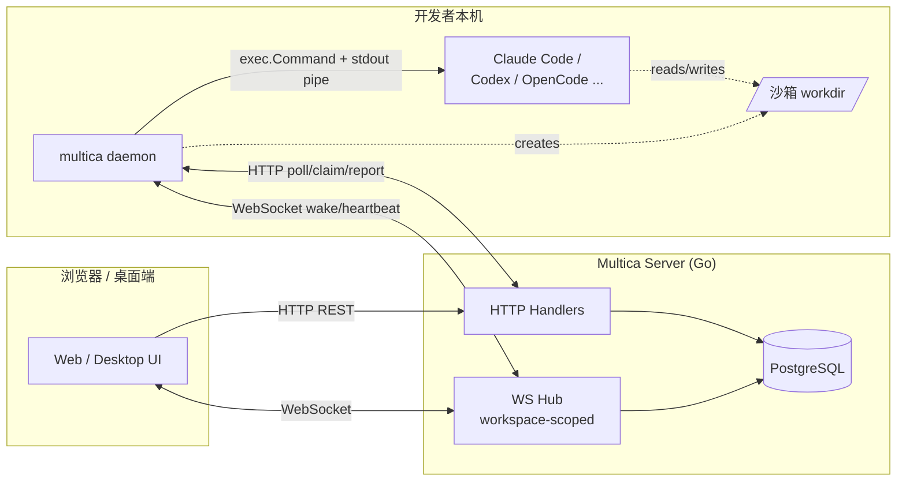
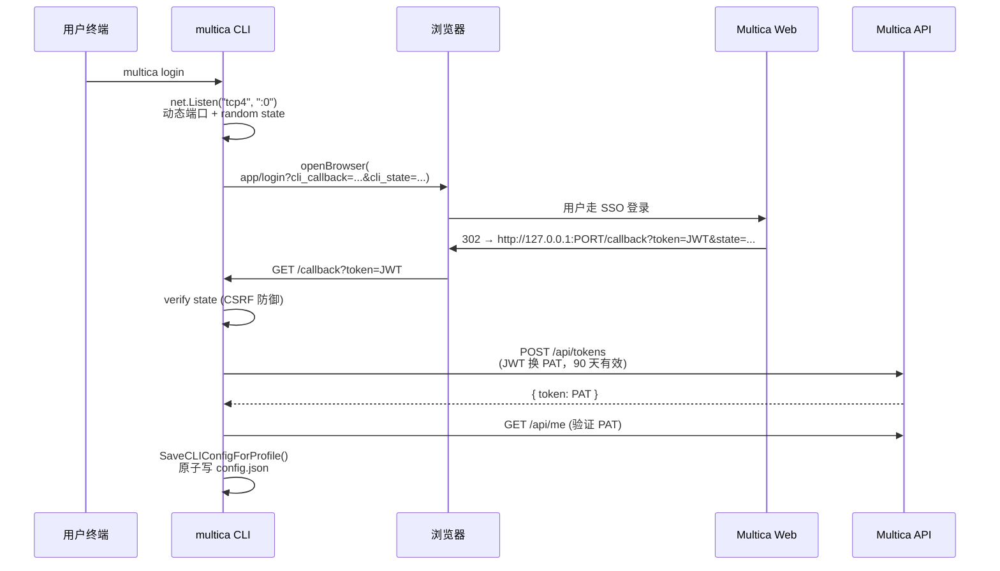
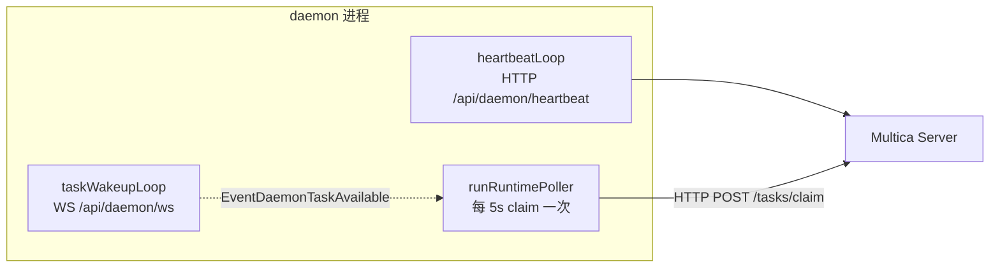
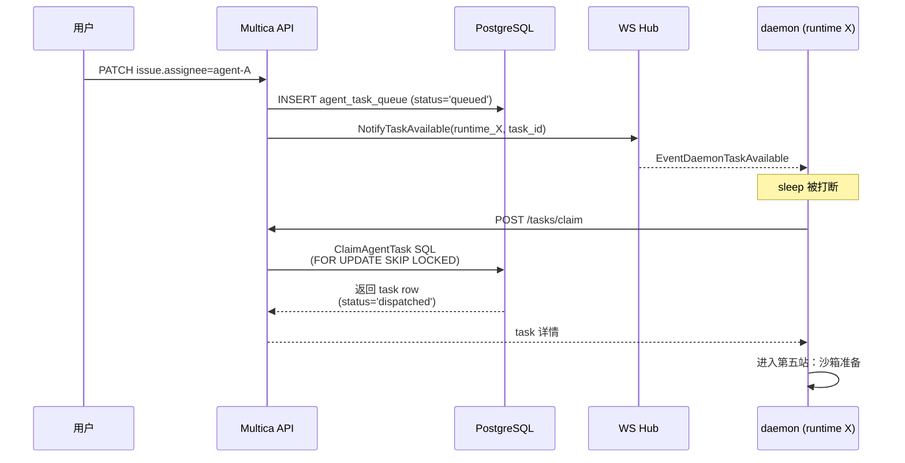
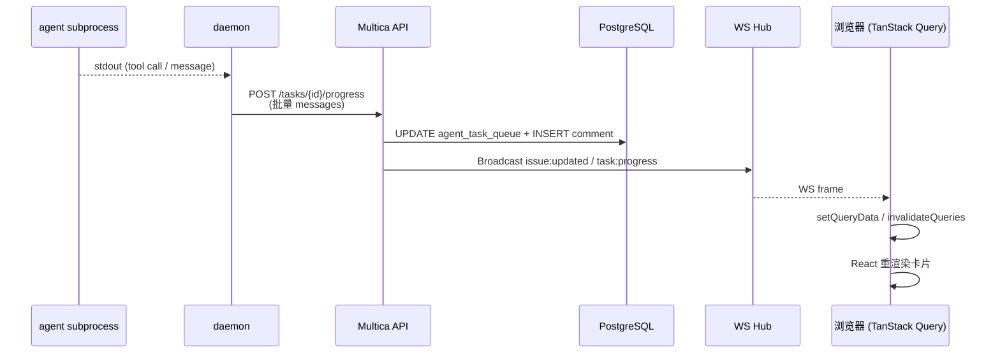
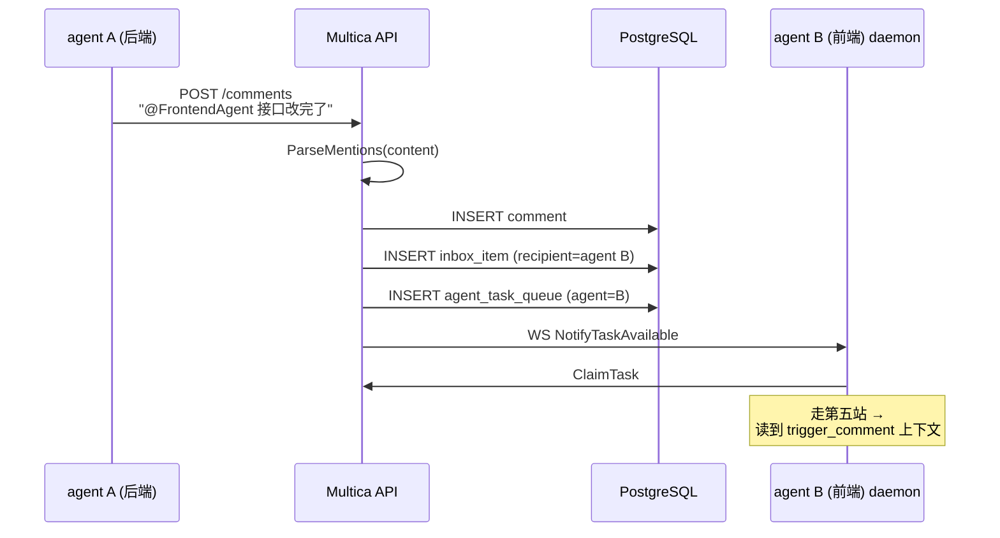
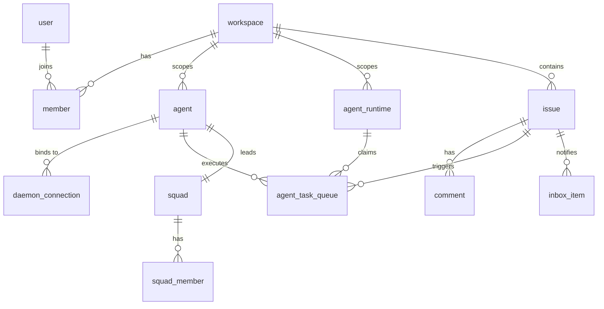

# Multica 技术架构：从 `multica login` 到 agent @ agent

> 看完 [《把 AI Agent 当队友：Agent 协作平台 Multica 分享》](../multica-share/multica-share.md) 还想再往下挖一层？这篇是写给你的。
>
> 分享文档讲"为什么用"，这篇讲"怎么做到的"。

---

## 这篇文档要回答什么

如果你刚装完 Multica、跑了一遍 `multica daemon`、在 web 上 assign 了第一个 issue 给 agent —— 表面上看到的就是"卡片上多了个进度条、agent 提了个 PR"。这背后到底走了哪些路径？

读完之后你应该能口述出这几个问题的答案：

- 我在终端敲 `multica login` 之后，token 是从哪儿来、存在哪儿、下次怎么用的？
- 两台同事机器同时跑了 daemon，怎么保证一个任务不会被两边同时领走？
- 子进程里跑的 Claude Code 怎么知道这个 issue 的上下文？Skills 是怎么注入的？
- agent A 在 comment 里 `@` 了 agent B —— 谁在解析这个 mention？B 怎么自动开始干活？
- daemon 半路崩了，进行中的任务会丢吗？
- 浏览器上那个实时滚动的 timeline，是 long-polling 还是别的什么？

整个旅程分成八站，每一站对应你作为开发者实际感知到的一次"动作"。

### 总体架构一图流



四层之间只有两类通道：**HTTP**（控制面：注册、claim、状态汇报）+ **WebSocket**（数据面 hint：唤醒、广播）。所有"真理"沉淀在 PostgreSQL —— 这是后面所有设计选择的出发点。

---

## 第一站：从 `brew install` 到 `multica login` — CLI 到底在做什么

### Cobra 命令树 + profile 隔离

Multica CLI 用 [Cobra](https://github.com/spf13/cobra) 组织命令。根命令在 [`server/cmd/multica/main.go`](../../server/cmd/multica/main.go)，挂着几十个子命令：`login` / `daemon` / `agent` / `issue` / `repo` / `config` / `setup` 等。最上层有三个 persistent flag：`--server-url`、`--workspace-id`、`--profile`。

`--profile` 是同机多账号/多 workspace 隔离的基础。看一下 [`server/internal/cli/config.go`](../../server/internal/cli/config.go#L11)：

```go
const defaultCLIConfigPath = ".multica/config.json"

type CLIConfig struct {
    ServerURL   string `json:"server_url,omitempty"`
    AppURL      string `json:"app_url,omitempty"`
    WorkspaceID string `json:"workspace_id,omitempty"`
    Token       string `json:"token,omitempty"`
}

func CLIConfigPathForProfile(profile string) (string, error) {
    home, _ := os.UserHomeDir()
    if profile == "" {
        return filepath.Join(home, defaultCLIConfigPath), nil // ~/.multica/config.json
    }
    return filepath.Join(home, ".multica", "profiles", profile, "config.json"), nil
}
```

- 默认 profile：`~/.multica/config.json`
- 命名 profile（比如你在两个 workspace 切来切去）：`~/.multica/profiles/<name>/config.json`

每个 profile 自己一份 token + workspaceID，加上后面要说的 daemon PID/log 也按 profile 分目录 —— 这让"同一台机器同时跑两个 daemon 接两个 workspace 的任务"成为可能（多 workspace 实践见 [multica-share.md §3.2](../multica-share/multica-share.md#32-公司内部可能怎么用)）。

### 登录：浏览器 OAuth 回调（不是 device code）

`multica login` 的核心实现在 [`cmd_auth.go:205`](../../server/cmd/multica/cmd_auth.go#L205) 的 `runAuthLoginBrowser`。它的关键步骤：



几个值得注意的细节：

- **`net.Listen("tcp4", ...)` 显式锁 IPv4**：macOS 上裸 `tcp` 可能开一个 IPv6-only socket，浏览器解析 `localhost → 127.0.0.1` 时连不上 —— 代码里写了这条注释（[cmd_auth.go:212](../../server/cmd/multica/cmd_auth.go#L212)）。
- **同机 vs 远程登录**：`resolveCallbackBinding` 会判断 callback host 该用 `127.0.0.1` 还是机器的 LAN IP（远程 SSH 场景 —— daemon 跑在服务器，浏览器在你笔记本）。
- **state 参数做 CSRF 防御**：16 字节随机数 hex 编码，回调时严格比对。
- **JWT 只是中转，最终保存的是 PAT**：浏览器拿到的是短期 JWT，CLI 用它去 POST `/api/tokens` 换一个 90 天的 personal access token。这样浏览器关掉之后 CLI 还能继续用。

### 原子写入 token

Token 保存到 `~/.multica/config.json`，[`config.go:79`](../../server/internal/cli/config.go#L79) 的 `SaveCLIConfigForProfile` 用的是标准的"先 tmp 后 rename"模式，并额外 chmod 0600：

```go
tmp, _ := os.CreateTemp(dir, ".config-*.json.tmp")
tmp.Write(append(data, '\n'))
tmp.Close()
os.Chmod(tmpPath, 0o600)   // 只有自己能读
os.Rename(tmpPath, path)    // 原子 rename
```

这样 CLI 半路被 Ctrl+C 也不会写出半截 JSON 把下次启动搞挂。

### 为什么不用 device code flow（输入 8 位码那种）？

device code 不需要本地开端口，远程 SSH 场景体验更顺；但本机场景下，浏览器自动跳转 + 自动回写 token 的体验显著好于"在浏览器看码、回终端敲码"。Multica 选择了体验优先，代价是处理两套 callback host（127.0.0.1 vs LAN IP）。

---

## 第二站：`multica daemon` 让你的机器变成 runtime

`multica login` 完，下一步是 `multica daemon start`。这一步真正把你的机器接入 Multica 的"任务网"。

### 探测 + 注册

daemon 启动时做三件事（[`daemon.go:708`](../../server/internal/daemon/daemon.go#L708) 的 `registerRuntimesForWorkspace`）：

```go
for name, entry := range d.cfg.Agents {
    version, err := detectAgentVersion(ctx, entry.Path)
    // ... skip if version too old ...
    runtimes = append(runtimes, map[string]string{
        "name": displayName, "type": name,
        "version": version, "status": "online",
    })
}

req := map[string]any{
    "workspace_id":      workspaceID,
    "daemon_id":         d.cfg.DaemonID,
    "legacy_daemon_ids": d.cfg.LegacyDaemonIDs,
    "device_name":       d.cfg.DeviceName,
    "cli_version":       d.cfg.CLIVersion,
    "launched_by":       d.cfg.LaunchedBy,
    "runtimes":          runtimes,
}
resp, err := d.client.Register(ctx, req)
```

逐项含义：

1. **探测本机装了哪些 agent CLI**：claude / codex / opencode / openclaw / copilot / pi / cursor / kimi / kiro —— 跑 `--version` 拿版本，过滤掉太老的。
2. **`daemon_id` 是稳定 UUID**：第一次启动生成、持久化到本地；旧版本可能用 hostname 衍生的 ID，`legacy_daemon_ids` 字段就是为这层迁移服务的。
3. **一次性把 N 个 runtimes 全报给 server**：每台机器装了几个 agent CLI，就上报几条 runtime。

服务端的 [`UpsertAgentRuntime`](../../server/pkg/db/queries/runtime.sql#L14) SQL 是这套设计的核心：

```sql
INSERT INTO agent_runtime (
    workspace_id, daemon_id, name, runtime_mode, provider,
    status, device_info, metadata, owner_id, last_seen_at
) VALUES ($1, $2, $3, $4, $5, $6, $7, $8, $9, now())
ON CONFLICT (workspace_id, daemon_id, provider)
DO UPDATE SET
    name = EXCLUDED.name,
    runtime_mode = EXCLUDED.runtime_mode,
    status = EXCLUDED.status,
    device_info = EXCLUDED.device_info,
    metadata = EXCLUDED.metadata,
    owner_id = COALESCE(EXCLUDED.owner_id, agent_runtime.owner_id),
    last_seen_at = now(),
    updated_at = now()
RETURNING *, (xmax = 0) AS inserted;
```

`ON CONFLICT (workspace_id, daemon_id, provider)` 这个 conflict key 是 idempotency 的源头：同一台机器（同 `daemon_id`）的同一个 provider（比如 `claude`）升级 CLI 版本，不会产生新行，只更新 `metadata` 和 `last_seen_at`。结果末尾 `(xmax = 0) AS inserted` 是 PG 特有的写法 —— 一行布尔值告诉调用方"这是新建 (true) 还是更新 (false)"，用于分析侧只在首次注册时发 `runtime_registered` 事件。

### 注册之后：WS + HTTP 双通道

注册成功后 daemon 起两套循环：



- **`taskWakeupLoop`**（[`wakeup.go`](../../server/internal/daemon/wakeup.go)）：保持一条到 `/api/daemon/ws?runtime_id=...` 的 WebSocket，订阅"任务可用"事件。这只是 wakeup 提示，**真正领任务靠下一站讲的 ClaimTask**。
- **`heartbeatLoop`**（[`daemon.go:1162`](../../server/internal/daemon/daemon.go#L1162)）：每 15 秒 POST `/api/daemon/heartbeat/{runtime_id}`。

这里有个值得点出的优化 —— HTTP 心跳并不总是发。看 [`runHeartbeatTick`](../../server/internal/daemon/daemon.go#L1237)：

```go
if d.wsHeartbeatRecentlyAcked(rid) {
    d.logger.Debug("heartbeat: skipping HTTP tick, WS recently acked", ...)
    return
}
// otherwise 走 HTTP
resp, err := d.client.SendHeartbeat(ctx, rid)
```

如果最近 2×interval 内 WS 心跳被 ack 过，HTTP 这一拍就跳过 —— 因为 WS 路径已经把 `last_seen_at` 刷新过了，再发一次 HTTP 等于多写一次 DB。一旦 WS 安静下来超过窗口，HTTP 心跳自动恢复，这是降级兜底。

### 故障恢复：runtime gone

注册不是一次性的。运行过程中可能发生：
- daemon 长时间断网，server 把它名下的 runtime 状态扫成 offline 甚至清掉
- 用户在 web 后台手动删了某个 runtime
- 工作站切了网络环境、daemon_id 没变但 server 那边对应不上了

任一情况下，HTTP heartbeat 会收到 404 —— [`runHeartbeatTick:1252`](../../server/internal/daemon/daemon.go#L1252) 检测到后调 `handleRuntimeGone(rid)` 跑一次重注册流程。WS 路径同样会通过 `RuntimeGone: true` 的 ack 触发同一个入口。这是这套架构能"自己愈合"的关键。

---

## 第三站：在 workspace 里"加一个 agent" — 身份和能力是怎么绑的

到这里你机器上的 daemon 已经把自己作为 N 个 runtime 报到了 server。但 Multica 的用户视角里**不是"我有几个 runtime"，而是"我有几个 agent"**（FrontendAgent / DBA-Agent / TestAgent 这种带 persona 的逻辑身份）。这两层是怎么对上的？

### agent vs runtime vs daemon_connection

看 [001_init.up.sql:36](../../server/migrations/001_init.up.sql#L36) 的 `agent` 表：

```sql
CREATE TABLE agent (
    id UUID PRIMARY KEY DEFAULT gen_random_uuid(),
    workspace_id UUID NOT NULL REFERENCES workspace(id) ON DELETE CASCADE,
    name TEXT NOT NULL,
    avatar_url TEXT,
    runtime_mode TEXT NOT NULL CHECK (runtime_mode IN ('local', 'cloud')),
    runtime_config JSONB NOT NULL DEFAULT '{}',
    visibility TEXT NOT NULL DEFAULT 'workspace'
        CHECK (visibility IN ('workspace', 'private')),
    status TEXT NOT NULL DEFAULT 'offline'
        CHECK (status IN ('idle', 'working', 'blocked', 'error', 'offline')),
    max_concurrent_tasks INT NOT NULL DEFAULT 1,
    owner_id UUID REFERENCES "user"(id),
    ...
);
```

三层关系一句话：
- **agent**：逻辑身份。一个名字（"FrontendAgent"）、一个头像、一段 `runtime_config`（要跑哪个 provider、prompt 偏好等）
- **agent_runtime**：执行能力。某台机器 × 某个 CLI 的具体进程载体
- **daemon_connection**（[001_init.up.sql:143](../../server/migrations/001_init.up.sql#L143)）：把两者粘起来 —— `agent_id ↔ daemon_id`，1:N 关系，同一个 agent 可以挂在多台机器上做容灾

在 web 上"创建 agent"实际上是写一行 `agent`，并通过 web UI 选一个 runtime 写入 `daemon_connection`。

### Polymorphic Assignee：agent 是一等公民的代码级证据

这是 Multica 整套设计的根基。看 issue 表（[001_init.up.sql:52](../../server/migrations/001_init.up.sql#L52)）：

```sql
CREATE TABLE issue (
    id UUID PRIMARY KEY DEFAULT gen_random_uuid(),
    ...
    assignee_type TEXT CHECK (assignee_type IN ('member', 'agent')),
    assignee_id UUID,
    creator_type TEXT NOT NULL CHECK (creator_type IN ('member', 'agent')),
    creator_id UUID NOT NULL,
    ...
);
```

comment 表（[001_init.up.sql:97](../../server/migrations/001_init.up.sql#L97)）：

```sql
author_type TEXT NOT NULL CHECK (author_type IN ('member', 'agent')),
author_id UUID NOT NULL,
```

inbox 表（[001_init.up.sql:110](../../server/migrations/001_init.up.sql#L110)）：

```sql
recipient_type TEXT NOT NULL CHECK (recipient_type IN ('member', 'agent')),
recipient_id UUID NOT NULL,
```

到了 [084_squad.up.sql](../../server/migrations/084_squad.up.sql) 又把 issue 的 `assignee_type` 扩到 `('member', 'agent', 'squad')`：

```sql
ALTER TABLE issue DROP CONSTRAINT IF EXISTS issue_assignee_type_check;
ALTER TABLE issue ADD CONSTRAINT issue_assignee_type_check
    CHECK (assignee_type IN ('member', 'agent', 'squad'));
```

这就是 **polymorphic `(type, id)`** 模型：寻址不是 `assignee_id` 单字段，而是二元组。前端拿到一条 issue，看到 `assignee_type='agent'` 就走 agent 头像渲染、`='member'` 就走真人头像、`='squad'` 就走小组渲染 —— 同一套卡片组件、同一套筛选/排序代码，只在最后一层渲染时分支。

### 为什么不把 agent 塞进 `user` 表？

最朴素的想法："给 user 表加一列 `type='ai'`"。Multica 没这么做，原因实际：
- agent 没有 email / 密码，也不应该有 login session
- agent 的生命周期跟 workspace 绑死（workspace 删了 agent 也没了），user 是全局对象
- agent 有 `runtime_config`、`max_concurrent_tasks` 这些独有字段，硬塞 user 表两边都长出对方不需要的列

更深一层：把"agent 提 PR、comment、@ 别人"做成 user 的一种 type，会导致鉴权 / 审计 / 通知所有路径都得加 if-else。polymorphic `(type, id)` 反而把这种 if-else 限制在最薄的一层（渲染 + 鉴权）。

---

## 第四站：assign issue 那一刻 — 任务是怎么排进队列的

你在 web 上把 issue assign 给一个 agent，或者在 comment 里 `@` 了它 —— 后台发生了什么？

### 入队：`CreateAgentTask`

handler 入口在 [`server/internal/handler/issue.go`](../../server/internal/handler/issue.go) 调 `TaskService.EnqueueTaskForIssue()`，最终落到这条 SQL（[`agent.sql:86`](../../server/pkg/db/queries/agent.sql#L86)）：

```sql
-- name: CreateAgentTask :one
INSERT INTO agent_task_queue (
    agent_id, runtime_id, issue_id, status, priority, trigger_comment_id,
    trigger_summary, force_fresh_session, is_leader_task
)
VALUES (
    $1, $2, $3, 'queued', $4, sqlc.narg(trigger_comment_id),
    sqlc.narg(trigger_summary),
    COALESCE(sqlc.narg('force_fresh_session')::boolean, FALSE),
    COALESCE(sqlc.narg('is_leader_task')::boolean, FALSE)
)
RETURNING *;
```

`agent_task_queue` 是核心调度表。关键列：
- `status`：`queued → dispatched → running → completed/failed/cancelled` 五态机
- `priority + created_at`：优先级 + FIFO
- `trigger_comment_id`：记录是哪条 comment 触发的这个任务（mention 场景下很关键）
- `trigger_summary`：派单时人/agent 写的一句话上下文，进 prompt
- `force_fresh_session` / `is_leader_task`：retry 和 squad 用到的 flag
- `context` (JSONB)：quick-create 任务（没 issue、没 chat）用这一列装完整 prompt + 元信息

入队完成后，server 通过 **WS Hub** 给目标 runtime 的 daemon 发一个 `EventDaemonTaskAvailable`（[`hub.go:NotifyTaskAvailable`](../../server/internal/daemonws/hub.go#L159)）：

```go
// NotifyTaskAvailable sends a best-effort wakeup to daemons watching runtimeID.
func (h *Hub) NotifyTaskAvailable(runtimeID, taskID string) {
    h.notifyTaskAvailable(runtimeID, taskID, "")
}
```

注意"best-effort wakeup hints"这个注释 —— **WS 通知只是叫醒，不是任务体本身**。daemon 收到后还是要走 HTTP 的 ClaimTask 才算真领走。这层"通知 / 领取分离"让 daemon 满载时可以装作没看到通知，任务自然留在队列里，server 不用维护背压状态。

### ClaimTask：本架构最值得读的一段 SQL

这是 Multica 整套并发设计的高潮。完整 SQL 在 [`agent.sql:204`](../../server/pkg/db/queries/agent.sql#L204)：

```sql
-- name: ClaimAgentTask :one
UPDATE agent_task_queue
SET status = 'dispatched', dispatched_at = now()
WHERE id = (
    SELECT atq.id FROM agent_task_queue atq
    WHERE atq.agent_id = $1 AND atq.status = 'queued'
      AND NOT EXISTS (
          SELECT 1 FROM agent_task_queue active
          WHERE active.agent_id = atq.agent_id
            AND active.status IN ('dispatched', 'running')
            AND (
              (atq.issue_id IS NOT NULL AND active.issue_id = atq.issue_id)
              OR (atq.chat_session_id IS NOT NULL AND active.chat_session_id = atq.chat_session_id)
              OR (
                atq.issue_id IS NULL
                AND atq.chat_session_id IS NULL
                AND atq.autopilot_run_id IS NULL
                AND active.issue_id IS NULL
                AND active.chat_session_id IS NULL
                AND active.autopilot_run_id IS NULL
              )
            )
      )
    ORDER BY atq.priority DESC, atq.created_at ASC
    LIMIT 1
    FOR UPDATE SKIP LOCKED
)
RETURNING *;
```

逐层解释：

1. **`FOR UPDATE SKIP LOCKED`**（PG 9.5+）：多 daemon 同时跑这条 query 时，被前一个事务锁住的行直接跳过，每个 daemon 拿到不同任务、互不阻塞。**这一行让 Multica 不需要 Redis/Kafka 就能做并发任务队列**。
2. **`ORDER BY priority DESC, created_at ASC LIMIT 1`**：优先级高的先走，同优先级 FIFO。
3. **`NOT EXISTS` 子查询做 per-(agent, target) 串行化**：核心约束 ——"同一个 agent 在同一个 issue 上的任务永远不并发"。如果 agent A 已经在 issue X 上跑了一个任务（`dispatched` 或 `running`），那 A 在 X 上的下一个排队任务必须等前一个结束。
4. **`target` 的三层定义**：分别是 `issue_id`、`chat_session_id`、`(三个 FK 全空的 quick-create 形状)`。chat 任务用 session 串行化、quick-create 任务用"任何其它 quick-create"串行化（防止用户疯狂按按钮）。

这条 SQL 解决了一个真实问题：**两个 task 同时跑会互改同一个 git worktree**。串行化保证你 review diff 时能精确还原 agent 当时看到的代码。

### daemon 端的接收：`runRuntimePoller`

daemon 是怎么决定什么时候来 claim 的？看 [`daemon.go:1854`](../../server/internal/daemon/daemon.go#L1854) 的 `runRuntimePoller`：

```go
func (d *Daemon) runRuntimePoller(
    pollerCtx, parentCtx context.Context,
    rid string,
    sem chan int,           // semaphore：MaxConcurrentTasks 个槽位
    wakeup <-chan struct{}, // WS 唤醒信号
    taskWG *sync.WaitGroup,
) {
    for {
        var slot int
        select {
        case slot = <-sem:                       // 拿到一个槽位
        case <-pollerCtx.Done():
            return
        default:
            d.logger.Debug("poll: at capacity", "running", d.cfg.MaxConcurrentTasks)
            sleepWithContextOrWakeup(pollerCtx, d.cfg.PollInterval, wakeup)
            continue
        }
        // 有槽位才去 claim
        task, err := d.client.ClaimTask(pollerCtx, rid)
        ...
    }
}
```

`MaxConcurrentTasks` 默认 2（可通过 `MULTICA_DAEMON_MAX_CONCURRENT_TASKS` 调到 6 甚至更高 —— [multica-share.md §3.2 场景 B](../multica-share/multica-share.md#32-公司内部可能怎么用) 里讲的"测试覆盖率并发"就是把它调大）。槽位用 channel 当 semaphore：满了不去 claim、任务留在队列。`sleepWithContextOrWakeup` 让 sleep 可以被 WS wakeup 提前打断 —— 这就是 WS 唯一的价值：把"下一次 claim"从 5s 后提前到几十 ms 后。



---

## 第五站：沙箱里跑 Claude Code — 从 claim 到 subprocess

claim 到任务后，daemon 干两件事：(1) 准备隔离的执行环境 (2) 起子进程跑 agent。

### 隔离 workdir

[`execenv.go:132`](../../server/internal/daemon/execenv/execenv.go#L132) 的 `Prepare` 是入口：

```go
envRoot := filepath.Join(params.WorkspacesRoot, params.WorkspaceID, shortID(params.TaskID))

// 防御性清理 — task ID 是唯一的，理论上不会撞
os.RemoveAll(envRoot)

workDir := filepath.Join(envRoot, "workdir")
for _, dir := range []string{workDir,
    filepath.Join(envRoot, "output"),
    filepath.Join(envRoot, "logs")} {
    os.MkdirAll(dir, 0o755)
}

// 写 .agent_context/issue_context.md + 项目 resources.json + skills（按 provider 分发）
writeContextFiles(workDir, params.Provider, params.Task)

// Codex 专属：CODEX_HOME + skills 注入
if params.Provider == "codex" {
    codexHome := filepath.Join(envRoot, "codex-home")
    prepareCodexHomeWithOpts(codexHome, ...)
    hydrateCodexSkills(codexHome, params.Task.AgentSkills, logger)
}
```

结果文件结构：

```
~/multica_workspaces/{workspace-id}/{task-id-short}/
├── workdir/                    # agent 真正工作的目录
│   ├── .agent_context/
│   │   └── issue_context.md    # issue 摘要 + 关联仓库 + 历史 comment
│   ├── .claude/skills/         # Claude provider 时注入到这
│   ├── .opencode/skills/       # OpenCode provider 时注入到这
│   ├── .multica/project/
│   │   └── resources.json      # 项目级附件
│   └── (agent 自己 checkout 出来的代码)
├── output/                     # agent 产物
├── logs/                       # 进程日志
└── codex-home/                 # Codex provider 时存在
```

### Skills 注入：用 provider 的原生发现机制

这是这一站最值得点的设计。[`context.go:122`](../../server/internal/daemon/execenv/context.go#L122) 的 `resolveSkillsDir` 按 provider 分发：

```go
switch provider {
case "claude":   // .claude/skills/
case "copilot":  // .github/skills/
case "opencode": // .opencode/skills/
case "openclaw": // skills/
case "pi":       // .pi/skills/
case "cursor":   // .cursor/skills/
case "kimi":     // .kimi/skills/
case "kiro":     // .kiro/skills/
default:         // .agent_context/skills/
}
```

**没有发明新协议**。每个 agent provider 自己定义了"我从哪儿读 skill"，Multica 就按它原生定义的位置写文件。后果：

- 你在 Multica web 里写的一个 Skill，本质上是 `name + content` 的几个文件
- daemon 按当前任务的 provider 写到对应位置
- agent CLI 自己发现并加载 —— 它根本不知道也不需要知道 Multica 的存在

更具体一点：你在本机单跑 `claude code` 时手写过的 `.claude/skills/go-conventions/SKILL.md`，和 Multica 派单时 daemon 注入的那个 SKILL.md，**对 Claude Code 来说是完全同一类文件**。零迁移成本。

### 子进程调度 + 实时回写

`agent.Backend.Execute()` 起 subprocess（[`daemon.go:2527`](../../server/internal/daemon/daemon.go#L2527) 调 `executeAndDrain`，定义在 [`daemon.go:2720`](../../server/internal/daemon/daemon.go#L2720)）。daemon 同时干三件事：

1. 流式读取 agent stdout，按事件解析（tool call / text / final message）
2. 实时 `client.ReportProgress()` 把事件 POST 回 server（更新 timeline，前端立刻能看到）
3. 5 秒一次 poll server 端的取消标志 —— 用户在 web 上点了 "Stop"，daemon 看到后 kill 子进程

为什么用 stdout pipe 而不是写文件再 tail？延迟显著低 —— 你在浏览器上感知到的"agent 在打字"几乎实时。

为什么每个 task 一个独立 workdir 而不是复用 worktree？避免两个并发任务踩坏对方的修改，也让审计/复盘时能精确还原"agent 当时看到的代码"。

---

## 第六站：实时回流 — 一行进度怎么从子进程跳到浏览器



### server 侧广播：workspace-scoped pub/sub

[`hub.go:Hub`](../../server/internal/daemonws/hub.go#L74) 维护两层索引：

```go
type Hub struct {
    upgrader websocket.Upgrader
    mu        sync.RWMutex
    clients   map[*client]bool
    byRuntime map[string]map[*client]bool   // runtime_id → 订阅它的客户端
    ...
}
```

广播路径上有一个值得点出的设计 —— **慢客户端不阻塞快客户端**。每个 client 有自己的 `send chan []byte`（buffer 16）+ 独立的 writePump goroutine；如果某个浏览器卡死，往它的 send chan 写入会非阻塞失败，hub 直接 evict 它。这样一个掉线的 tab 不会拖死整个 workspace 的实时推送。

### 前端：WS 事件 → TanStack Query

前端不维护自己的 server state 副本。WS 事件**只动 Query cache，不动 Zustand store**。看 [`use-realtime-sync.ts`](../../packages/core/realtime/use-realtime-sync.ts)：

```typescript
const unsubIssueUpdated = ws.on("issue:updated", (p) => {
  const { issue } = p as IssueUpdatedPayload;
  if (!issue?.id) return;
  const wsId = getCurrentWsId();
  if (wsId) {
    onIssueUpdated(qc, wsId, issue);
    if (issue.status) {
      onInboxIssueStatusChanged(qc, wsId, issue.id, issue.status);
    }
  }
});
```

`onIssueUpdated`（[`ws-updaters.ts`](../../packages/core/issues/ws-updaters.ts)）的实现是 patch + invalidate 组合：

```typescript
qc.invalidateQueries({ queryKey: issueKeys.myAll(wsId) });
qc.invalidateQueries({ queryKey: issueKeys.assigneeGroupsAll(wsId) });
qc.setQueryData<Issue>(issueKeys.detail(wsId, issue.id), (old) =>
  old ? { ...old, ...issue } : old,
);
```

- detail 查询能 patch 的直接 patch（响应快）
- list 类查询 invalidate，让下次访问时刷新

这条规则的硬性约束在 [`CLAUDE.md`](../../CLAUDE.md) 里有写：「WS events invalidate queries — they never write to stores directly」。Query cache 是 server state 的唯一来源，避免双 source of truth 引发的诡异不一致。

### 为什么不让 daemon 直连浏览器？

daemon 在用户本地内网，浏览器可能在任何网络环境。P2P 不可能通用，server 中转是唯一通解。代价：每次状态变化要"daemon → server → hub → 浏览器"四跳；但 PostgreSQL 写一次 + WS fan-out 一次的成本在小团队规模下完全可控。

### 为什么 WS 不直接带完整业务数据？

WS 事件携带的是"最小变更 hint"（issue ID + 关键字段），而不是完整的 issue body。前端拿到事件后，能 patch 的本地 patch、不能的去 server 拉一次新版。这是 TanStack Query 的标准做法 —— **server 是真理来源，WS 只是 cache invalidation hint**。

---

## 第七站：agent 之间互相 `@` — 协作链路是怎么自动跑起来的

这是 Multica 把"agent 是队友"做到极致的地方。一句 `@FrontendAgent` 能跨 agent 触发任务。

### Mention 协议：markdown link with custom scheme

用户（或某个 agent）在 comment 里写：

```markdown
[@FrontendAgent](mention://agent/8c5e2a4d-...)
[@DataTeam](mention://squad/12ab34cd-...)
[@yzl](mention://member/9f8e7d6c-...)
```

server 在持久化 comment 时调 `util.ParseMentions(content)`，解析出 `(type, id)` 二元组列表。`type` 可以是 `member` / `agent` / `squad`，对应前面 polymorphic 模型里的三种 recipient。

每个 mention 写一行 [`inbox_item`](../../server/migrations/001_init.up.sql#L110)：

```sql
recipient_type='agent', recipient_id=<uuid>, type='mentioned',
issue_id=<当前 issue>, title='You were mentioned by ...'
```

### 自动派单：type=agent 直接入队

handler 接下来的判断很简单：

- `type='member'`：写完 inbox 就结束 —— 真人需要主动决定"我接不接"
- `type='agent'`：写 inbox + 调 `EnqueueTaskForIssue(agent_id, issue_id, trigger_comment_id, trigger_summary)`
- `type='squad'`：找 [`squad.leader_id`](../../server/migrations/084_squad.up.sql#L7) 这个 agent，给 leader 派单

第二种就是"agent 收到 @ 后自动开始干活"的实现。`trigger_comment_id` 指向触发它的那条 comment，daemon 准备 prompt 时会把 comment 内容塞进 issue_context.md，所以 agent 知道"刚才谁 @ 了我、说了什么"。



### Squad：leader 是真正"思考"的角色

squad 不是"自动并行执行器"，是社交单元。`@DataTeam` 触发的是 squad 的 leader（一个 agent）—— leader 拿到任务后，**自己决定**怎么拆，再通过 comment + mention 把子任务派给 squad_member（可以是其他 agent，也可以是真人）。

为什么不让系统自动按 round-robin 派？因为"怎么拆任务"高度依赖上下文判断，LLM 比硬编码规则强。但这也是 squad 的天花板 —— leader prompt 写得好不好，决定了整支队伍能跑多远。

### 为什么 @ agent 立刻派任务、@ 真人只发 inbox？

这是个值得展开的设计选择。真人接 inbox 是一种"决策点"：你看完描述，决定接不接、什么时候接。agent 没必要把这一步搬到 inbox 上 ——"接不接"的决策应该前置到 prompt 设计阶段（你信不信任这个 agent、它能不能干这种活），到 inbox 已经太晚。所以 agent 收到 @ = 直接派单，把决策权放在更合适的位置。

---

## 第八站：故障与恢复 — 这套架构怎么"不丢任务"

最后一站讲健壮性。Multica 在以下场景下都不会丢任务：

**1. daemon 进程崩了 / 机器断网**
- server 端有 sweeper goroutine（参考 [`runtime.sql:SelectStaleOnlineRuntimes`](../../server/pkg/db/queries/runtime.sql#L98)）周期扫 `last_seen_at` 超时的 runtime，把状态翻 offline
- 任务侧另有 reaper 把该 runtime 名下 `dispatched/running` 状态超时未完成的任务标回 `queued`
- 下次有 daemon 上线（或同 runtime 重启），通过 ClaimTask 重新领走

**2. 网络瞬断**
- WS 自动重连；重连期间 HTTP 心跳兜底（前面讲过 WS-fresh 跳过 HTTP 是优化，不是必要 —— WS 一安静 HTTP 自动恢复）
- 进行中的子进程不受影响（agent 跑在本地，不依赖 server 在线）

**3. 任务被用户取消**
- server 设取消标志
- daemon 每 5s poll，看到就 kill 子进程，写 `failed` + `failure_reason='cancelled'`

**4. runtime 被服务端清掉**
- HTTP heartbeat 收 404 / WS ack 收 `RuntimeGone:true` → [`handleRuntimeGone`](../../server/internal/daemon/daemon.go#L238) 重走 register 流程
- 旧 daemon_id（hostname 衍生的）→ 新 daemon_id（UUID）有迁移路径：注册请求里同时带 `daemon_id` + `legacy_daemon_ids`，server 端识别后老 runtime 平滑过渡

**5. 同一 task 被两个 daemon 同时尝试 claim**
- 不可能。`FOR UPDATE SKIP LOCKED` 在 DB 层就保证最多一个事务能把 row 推到 `dispatched`

这套设计能成立的根本原因：**所有"真理状态"都在 PostgreSQL 行里**，daemon 和 server 都不持有 in-memory 任务状态。任意一方崩了，对方靠 DB 就能恢复出"现在该干什么"。

---

## 附录：关键表速查



四处 polymorphic `(type, id)` 的具体位置：

| 表 | 类型字段 | ID 字段 | 可取值 |
|---|---|---|---|
| `issue` | `assignee_type` | `assignee_id` | `member` / `agent` / `squad` |
| `issue` | `creator_type` | `creator_id` | `member` / `agent` |
| `comment` | `author_type` | `author_id` | `member` / `agent` |
| `inbox_item` | `recipient_type` | `recipient_id` | `member` / `agent` |

核心调度表 `agent_task_queue` 的状态机：

```
queued ──claim──> dispatched ──start──> running ──complete──> completed
   │                  │                     │       └─fail──> failed
   │                  └─dispatch timeout────┤
   │                                        │
   └─────────────cancel──────────────────────┴─────> cancelled
```

---

## 结语：把成熟的东西拼对，比发明新东西更难

回到分享文档里的那句话：

> Multica 没有发明任何全新的轮子，它只是把这几件已经成熟的东西组合得很合理，使得"让 agent 成为团队成员"这件事在工程上变得可行。

读完八站之后，这句话有了更具象的拆解：

1. **polymorphic `(type, id)` 类型设计** —— ORM 教材里讲了二十年的老话题，让 agent 的 issue / comment / inbox 全部走真人同一套路径
2. **PostgreSQL `FOR UPDATE SKIP LOCKED`** —— PG 9.5 就有的并发原语，让无 Redis/Kafka 的分布式任务队列成为可能
3. **WS hub + workspace-scoped pub/sub + 慢消费者 evict** —— gorilla/websocket 标准范式，让实时推送规模化
4. **provider-native skill 发现** —— 不发明新协议，让每个 agent CLI 在 Multica 内外是同一个 agent，零迁移成本
5. **PG 当 single source of truth + DB 行锁做 claim** —— 让 daemon crash、网络分区、用户取消等故障下"不丢任务"的承诺有 DB 层背书

每一件单独看都不新，但拼在一起，就让"AI agent 是团队队友而不是工具"在工程上变得可行。

这套设计的真正价值，不是某个聪明的 trick，而是**克制** —— 在每一个该上 Redis / 该写新协议 / 该自定义 RPC 的地方，都选择了"用现成的东西多想一步"。这才是这份代码值得一读的地方。

---

如果你读到这里还有问题、或者发现哪里写错了、或者想知道某个细节更深一层（比如"sweeper 的具体扫描频率"、"WS 重连退避策略"、"Skills 的 ordering 规则"），欢迎直接在 Multica 里开一个 issue assign 给 `@DocsAgent`。
