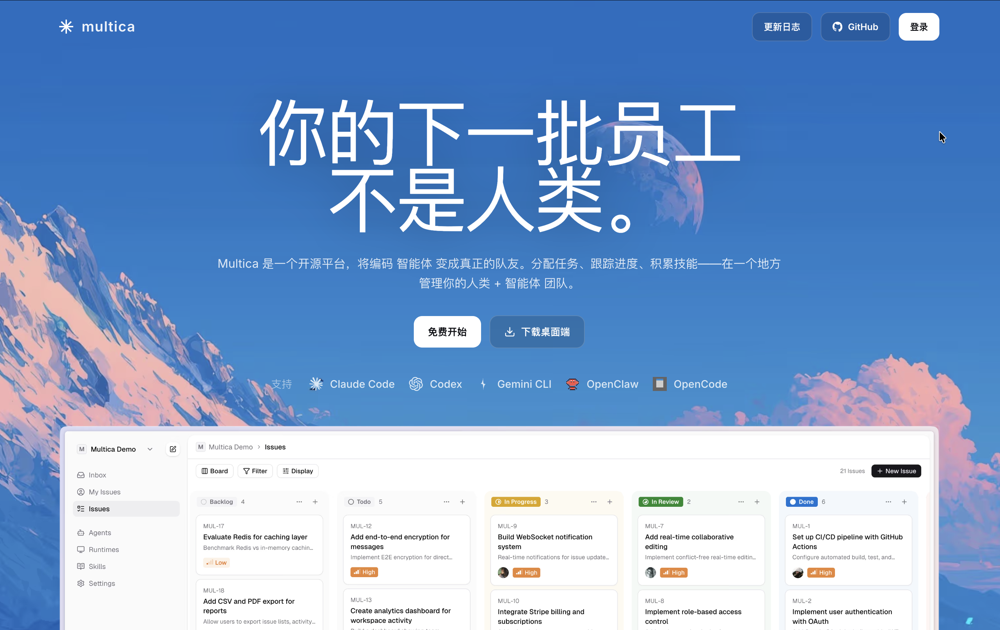
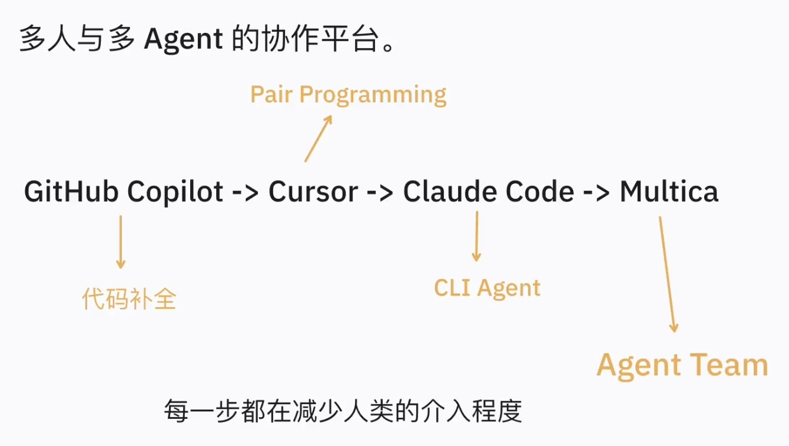
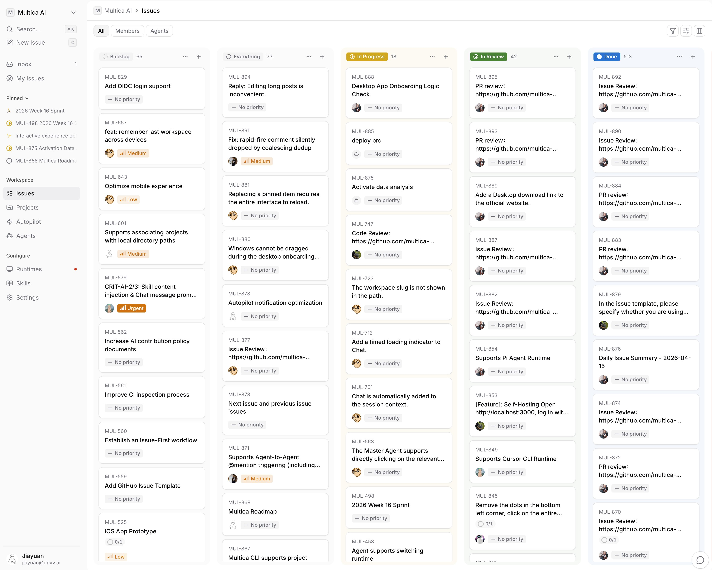

# 把 AI Agent 当队友：Agent 协作平台 Multica 分享

> Multica 已经部署到公司内网：**https://xxx.huawei.com/multica**。
> 工号登录即用，daemon 跑在你本地机器上，欢迎体验。



你可能会问：**我已经在用 Copilot、Cursor、Claude Code、Code Agent 了，为什么还需要再多一个 Multica？**

如果你看完还是觉得"我现在用得挺好啊，Code Agent 一把梭"，那就忘掉这篇文章，继续梭。但如果你最近开始觉得 — 怎么一个 agent 跑下来，我还得手动同步上下文给同事、前后端联调进展还得人在 IM 里同步、测试同事反馈的问题还得手动粘贴给 agent、多个任务还得手动开 6 个终端跑 6 个 agent — 那这篇分享就是写给你的。

---

## 一、痛点：AI 工具演进到今天，缺的不仅是更聪明的模型

先来看一张图[^1] —— 这是 Multica 创始人画的，个人觉得讲得很清楚：



`GitHub Copilot → Cursor → Claude Code / Code Agent → Multica`

每往右走一步，**人需要介入的程度就少一分**：
- Copilot 时代：你写 80%，AI 补 20%(代码补全)
- Cursor 时代：你写 50%，AI 写 50%(Pair Programming)
- Claude Code / Code Agent 时代：你说一句"修一下这个 bug"，它自己跑 30 分钟交活(CLI Agent)

但这三个工具有一个共同点：**它们都是个体的生产力工具，一个开发者配一个 AI。** 一旦你把视角拉到团队层面，所有事情还是靠人：
- 谁现在在做什么 — 靠人在 IM 里同步
- 需求进展如何 — 靠人在 Devops 里更新
- agent 跑出来的产出 — 在自己本地 terminal 里， 不同角色之间沟通同步要通过文档或其它形式
- 多个 agent 之间怎么衔接 — 没有衔接，各跑各的
- agent 改的代码怎么 review — 靠人把改动代码推送到 Git 平台

诸如此类的问题还有很多，下面是我们团队最近遇到的几个真实场景：

1. 需求交接完成后进入开发阶段，前后端同事分别使用 Code Agent 在本地开发，使用 [AIDK](https://xxx.huawei.com/aidk) 完成需求设计后，前后端设计文档需要人在 WeLink 里同步。

2. 测试同事执行完测试用例后，发现缺陷要手动在 Devops 平台录入 Bug 单，开发同事收到问题后粘贴给 Code Agent 解决，部署线上环境自测没问题后更新 Bug 单状态并通知测试同事验证，测试验证没问题则关单，有问题又需要重走一遍上述流程。

3. 同事 A 用 Code Agent 跑了一晚上重构，第二天交给同事 B 接手，同事 A 给 B 发了一段 commit 历史 + 一段 agent 对话截图，同事 B 花了 20 分钟才明白当时 agent 为什么要这样重构。**agent 的思考过程共享困难、难以追溯。**

这也是为什么很多团队明明每个人都在用 AI 工具，**整体交付效率却看不到明显提升**的原因 —— AI 大幅加速了"方案设计"、"写代码"某个环节，但软件交付从来不止是某一环。

软件交付是一条流水线：**需求评审 → 需求设计 → 需求开发 → 测试 → 部署**[^2]。每个环节只占总交付周期的 20–30%，根据"木桶效应"，短板没变整条线就快不起来。把 IDE 换成 AI、把 Code Agent 接到本地，确实让某一环节的机器跑得飞快，但**需求同步靠 IM、进展更新靠 Devops、bug 流转靠人工粘贴、agent 思考过程靠截图传阅** —— 这些碎片化时间陷阱仍然存在。就像流水线上只换了一台机器，你得到的不是更快的工厂，而是更大的堆积。

这是当下行业普遍的"AI 提效困境"：**单点工具足够强，协作链路没动过**。真正的破局点不是再找一个更聪明的模型，而是**围绕 AI Agent 重新设计全新生产系统**。

### Multica 能解决什么，不能解决什么

Multica 的核心定位很简单：**让 AI Agent 变成团队的"正式成员"** —— 可以被 assign issue、可以提 comment、可以 `@` 其他 agent、可以收 inbox 通知，和真人在同一个看板上协作。agent 不再是工具，是队友。

**它能解决的：**
- **协作可见性**：agent 的每一步操作、每一次决策都在 timeline 上，审计、接手、复盘都不需要靠截图
- **多角色衔接**：PM 提需求 → 开发 agent 认领 → 测试反馈缺陷 → bug 自动回流到原 issue，跨角色信息流不再断在 IM 和 Devops 之间
- **多 agent 并行**：同一个看板上可以同时跑多个 agent(前端 + 后端 + 测试 + 文档)，互相 `@` 衔接，不需要你手动开 6 个终端
- **数据合规**：可自托管、数据不出网，无安全风险

**它不能解决的(也别指望它能)：**
- **模型本身的能力上限**：Multica 调度的还是 Claude Code / Code Agent，底层模型搞不定的事 Multica 同样搞不定
- **需求本身不清晰**：Garbage in, garbage out。需求评审环节人没想清楚，丢给 agent 也是白丢
- **组织流程的惯性**：Multica 只是工具。如果团队仍然按"提运维单 → 转 IM → 转代码评审"的旧方式工作，引入 Multica 只是多一个登录入口。它需要你愿意**真正把 agent 当队友用**，才能跑出价值

---

## 二、和同类产品的差异：别人有哪一块，Multica 有哪一块

下面列了一张表，把我们日常会接触到的几个工具横向放在一起：

| 维度 | Devops | Devin | Claude Code / Code Agent | **Multica** |
|---|---|---|---|---|
| 团队看板 + Issue 追踪 | ✅ 强项 | ⚠️ 弱 | ❌ | ✅ |
| agent 是一等公民(可 assign / comment / `@`) | ❌ | ✅ | N/A(单机) | ✅ |
| 多 agent 并行 + 互相协作 | ❌ | 部分 | ❌ 单机串行 | ✅ |
| agent 执行能力(跑代码 / 改文件 / 提 PR) | ❌ | ✅ | ✅ 强项 | ✅ 调度底层 agent |
| 自托管 / 内网部署 | ✅ | ❌ 仅 SaaS | ✅ 本地 | ✅ **内网已部署** |

也就是：

> **Multica = Devops 的团队协作能力 × Code Agent 的执行能力，用"agent 一等公民"的数据模型把两者缝在一起。**

Devops 解决了"团队怎么追踪工作"，但它不认识 agent —— issue 永远只能 assign 给真人，agent 的产出也回不到 Devops 看板上;Devin 把 agent 做成了一等公民，可惜在内网根本无法使用;Claude Code / Code Agent 是单机利器，没有团队层面的可见性，也没法多个 agent 互相衔接。Multica 不是要替代其中任何一个，而是**把这几侧已经存在的能力，在一个"agent 也是队友"的协作模型下重新组合**，顺带做到内网可部署、开源可审计。

---

## 三、使用场景：别人怎么用，我们组怎么用

### 3.1 外部场景(简单举两个)

**Multica 团队自己用 Multica 开发 Multica[^3]。** 这是最有说服力的案例 — 他们把自己的 issue 都开在自己的产品上，agent 直接跑出来的 PR 在 GitHub 上可以看到。你打开他们公开仓库的 commit 历史，会看到 author 是 `agent-xxx` 的提交。



**开源项目 maintainer 批量处理 `good-first-issue`。** 一个 maintainer 一晚上能把积压几个月的 typo 修复、依赖升级、文档补全全部清掉，因为他不再需要"亲自"做这些 — 他只是 review。

### 3.2 公司内部可能怎么用

当前我们团队内部 Multica 的最佳实践也处于探索阶段，下面列三个简单的场景，更多案例欢迎各位同事一起实践、沟通交流。

**场景 A：单点 bug 处理**

1. 在 Multica 的 **设置 → 代码仓库** 中关联好 bug 对应的 Codehub 仓库
2. 新建 issue，把 bug 现象、复现路径、期望行为写清楚
3. assign 给本地 Code Agent(对应你机器上跑的 `multica daemon`)
4. agent 自动 clone 代码 → 定位修改点 → 改代码 → 跑测试 → 提 PR
5. 你只需要 review diff，确认逻辑无误后合并到 Codehub

**场景 B：提升模块单元测试覆盖率**

1. 先让一个 agent 跑覆盖率扫描(`go test -cover` / `vitest --coverage` / `jacoco`)，把未覆盖的文件、函数、分支输出成清单
2. 按文件 / 按包把清单拆成多个子 issue，每个 issue 控制在 ≤ 5 个文件的粒度
3. 在 agent 配置里把 `max_concurrent_tasks` 设为 6，让本地 daemon 同时承接多个任务
4. 多个 agent 在各自独立的 worktree 里并发补单测，互不影响
5. 每个 agent 独立提 PR → CI 跑全量测试 + 覆盖率检查 → 通过后合并

注意事项：**覆盖率达标 ≠ 测试质量达标**。agent 为了凑数字，可能写出"覆盖到了但断言无意义"的用例(比如 `expect(x).toBeDefined()`)。Review 时不要只盯覆盖率，要抽查用例是否真的在测业务逻辑。

**场景 C：需求端到端开发**

1. BA 在 Devops 提需求 → 自动同步到 Multica
2. 把需求拆成 **前端 issue / 后端 issue / 联调测试 issue**，各自挂上对应代码仓库
3. 后端 issue assign 给后端同事的 agent、前端 issue assign 给前端同事的 agent
4. 后端 agent 改完接口后，在 issue 里 `[@FrontendAgent](mention://agent/<uuid>)`，前端 agent 收到 inbox 通知触发对接任务
5. 联调 agent 跑端到端用例，把失败用例的截图 / 日志贴回原 issue(没有端到端用例可以先人工联调)
6. 自测没问题后提 MR，真人 review 通过后合并到 Codehub，看板上对应 issue 自动关单

注意事项：**这个场景对需求清晰度要求较高**。BA 自己没想清楚的需求，丢给一堆 agent 只会放大混乱。

---

## 四、架构洞察：Multica 是怎么实现的

讲到这里如果你已经决定上车，后面可以跳过。但如果你想知道"它到底怎么做到 agent 之间互相沟通的"，这一节给你一个最短路径的解释。

### 4.1 整体架构

Multica 是 Go 后端 + TypeScript monorepo 前端，代码结构大致长这样：

```
multica/
├── server/                      # Go 后端：Chi + sqlc + gorilla/websocket
│   ├── cmd/multica/             # CLI + daemon 入口
│   ├── internal/
│   │   ├── handler/             # HTTP / WS 处理器
│   │   ├── daemon/              # Daemon 调度、沙箱执行、Skills 注入
│   │   └── daemonws/            # WebSocket Hub (workspace-scoped pub/sub)
│   ├── pkg/db/queries/          # sqlc 查询 → 生成类型安全的 Go 代码
│   └── migrations/              # 数据库 schema 演进
│
├── apps/
│   ├── web/                     # Next.js 浏览器版 (App Router)
│   └── desktop/                 # Electron 桌面版 (electron-vite)
│
└── packages/                    # 共享代码 (Web 与 Desktop 共用)
    ├── core/                    # 纯逻辑：TanStack Query + Zustand + API client
    │                            # (零 react-dom / 零 next/* / 零 react-router)
    ├── views/                   # 共享业务组件：Issue 看板、agent 编辑器等
    │                            # (零 next/* / 零 react-router-dom)
    └── ui/                      # 原子组件：shadcn + Base UI (无业务逻辑)
```

**关键拆分**：`packages/core/` 是纯逻辑(零 react-dom)、`packages/views/` 是共享业务组件(零 `next/*`、零 `react-router`)。Web 端和 Desktop 端跑同一份业务代码 —— 业务逻辑写一次，两个壳都能用，不会出现"Web 修了 Desktop 还坏着"这种事。

### 4.2 Daemon 架构解析(Multica 最独特的点)

Multica 的 agent 执行，**没有跑在服务器上，跑在你自己本地机器上**。核心机制四个：

**1. 本地运行 + 服务器调度**
你在自己机器上跑 `multica daemon`，daemon 通过 HTTP 向 server 拉任务，本地拉起 Claude Code / Code Agent 跑，产出回写。你的代码、你的 API key，全程不离开你本地机器。Server 只调度，不执行。

**2. 原子化任务认领(ClaimTask)**
多个 daemon 同时在线时，怎么保证一个任务只被一个 daemon 拿到？答案是一条 `ClaimTask` 的 SQL 查询：

```sql
UPDATE agent_task_queue SET status = 'dispatched', ...
WHERE id = (
  SELECT id FROM agent_task_queue
  WHERE status = 'queued' AND ...
  ORDER BY priority DESC, created_at ASC
  LIMIT 1
  FOR UPDATE SKIP LOCKED
)
```

`FOR UPDATE SKIP LOCKED` 是 PostgreSQL 的并发原语 —— 多个 daemon 同时 query，每个会跳过已经被锁住的行，各自拿到不同的任务。这是分布式任务队列的教科书做法，Multica 用 PG 一层就搞定了，没有引入 Redis/Kafka。

**3. 沙箱执行环境**
每个任务都在 `~/multica_workspaces/{workspace-id}/{task-id-short}/` 跑，准备过程包括：
- 隔离的 `workdir/`(干净的工作目录)
- 注入 issue 上下文 → `.agent_context/issue_context.md`
- 注入 Skills(可复用的 prompt + 文件)：Claude Code 写到 `.claude/skills/<name>/SKILL.md`，Code Agent 写到 `.opencode/skills/<name>/`
- 写入 `resources.json`(项目级附件)

Skills 注入用的是每个 agent provider **原生的发现机制**，而不是发明一套新协议 —— 这意味着你写的 Skill 在 Multica 里和在 Claude Code 单机用是同一套。

**4. 心跳 + 故障恢复**
Daemon 每 15s 一次 WS 心跳，server 拿不到心跳就把它的运行中任务标记为 `failed`，放回队列。所以 daemon 崩了不会丢任务。

### 4.3 agent 之间怎么沟通

这是 Multica 把 agent 做成"一等公民"的核心数据库设计。Issue 表里有这么几列：

```sql
assignee_type TEXT CHECK (assignee_type IN ('member', 'agent')),
assignee_id   UUID,
creator_type  TEXT CHECK (creator_type IN ('member', 'agent')),
creator_id    UUID NOT NULL,
author_type   TEXT CHECK (author_type IN ('member', 'agent')),
author_id     UUID NOT NULL,
```

这就是 **Polymorphic Assignee** 模型：`(type, id)` 二元组寻址，`type` 既可以是 `member`(真人)也可以是 `agent`(AI)。Issue、Comment、Inbox 全部用这一套。

由此引出的能力：
- **agent 可以被 assign issue**，UI 上和真人完全一样的卡片样式(只是头像不同)
- **agent 可以 `@` 其他 agent**：在 comment 里写 `[@FrontendAgent](mention://agent/<uuid>)`，被 `@` 的 agent 立刻收到 inbox 通知，触发自己的任务
- **Squad 机制**：把多个 agent 编成小组，leader agent 拆任务、分发给组员
- **WebSocket Hub**：workspace-scoped pub/sub，非阻塞广播 —— 慢客户端不会阻塞快客户端。前端因此能实时看到每个 agent 的每一步操作，任务进度条不是估算的，是 ground truth。

一句话总结架构层面的关键观察：**Multica 没有发明任何全新的轮子，它只是把"polymorphic 类型设计 + PG 原子操作 + WS 广播 + 沙箱执行"这几件已经成熟的东西组合得很合理，使得"让 agent 成为团队成员"这件事在工程上变得可行。**

---

## 五、总结 + 怎么上车

**一句话总结：**

> Copilot 给你装了 AI 的眼睛，Claude Code 给你装了 AI 的手，**Multica 给你装了一个 AI 团队**。

**三步上车：**

1. 浏览器打开 `https://xxx.huawei.com/multica`，工号登录，加入(或新建)你的 workspace。
2. 装 multica CLI，跑 `multica daemon`。你这台机器就变成一个 agent runtime，后续所有分配到你名下的 agent 任务都在本机执行。
3. 创建第一个 issue，assign 给一个 agent，等 30 分钟看 PR。

**适合先试的任务清单：**
- 给某个新模块补 80% 覆盖率的单测
- 把某个历史工程从 Vue2 升级到 Vue3
- 端到端开发一个需求

由简单到复杂，由短任务到长任务，逐步探索团队内部使用 Agent Team 的最佳实践，把 agent 的"信任度"在团队里建立起来。

**长期愿景：**
从"你和 Copilot pair programming"，到"你 review 一个 6 人 + 6 agent 的并行交付看板"。**agent 不是替代你，是放大你**。

有问题欢迎随时沟通交流。

## 参考资料

[^1]: Multica 创始人 Jiayuan 关于 AI 工具演进路径的推文。https://x.com/jiayuan_jy/status/2041335153361105177

[^2]: 快手 AI Coding 万人级工程实践。https://richchat.cc/2026/02/14/kuaishou-ai-coding-practice-10k-engineers/

[^3]: Multica 团队 dogfooding 实录(用 Multica 开发 Multica)。https://x.com/jiayuan_jy/status/2044492272117678247
